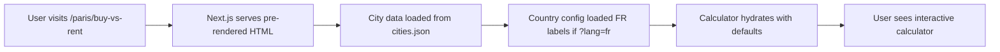

# RentOrBuy-Pro: Technical Architecture Documentation

**Version:** 2.0
**Last Updated:** December 2025
**Framework:** Next.js 16 (App Router)
**Language:** TypeScript 5.6
**UI Framework:** React 19
**Styling:** Tailwind CSS 3.4
**Charts:** Recharts 2.15
**UI Components:** Radix UI + shadcn/ui

---

## Table of Contents

1. [System Overview](#system-overview)
2. [Project Structure](#project-structure)
3. [Core Architecture](#core-architecture)
4. [Data Flow](#data-flow)
5. [Key Components](#key-components)
6. [State Management](#state-management)
7. [Internationalization (i18n)](#internationalization-i18n)
8. [Financial Calculation Engine](#financial-calculation-engine)
9. [Routing & SSG Strategy](#routing--ssg-strategy)
10. [Build & Deployment](#build--deployment)
11. [Best Practices Audit Checklist](#best-practices-audit-checklist)

---

## System Overview

**RentOrBuy-Pro** is a multi-language, international financial calculator that helps users decide whether to rent or buy property in 46+ cities across 14 countries. It performs a comprehensive 30-year financial analysis comparing the net worth outcomes of renting vs. buying.

### Key Features
- **Multi-language Support:** 8 languages (EN, FR, DE, ES, IT, NL, SV, PT) with full UI localization
- **International Coverage:** 14 countries, 46 cities with country-specific tax/closing costs
- **Static Site Generation (SSG):** All 46 city pages pre-rendered at build time
- **Global Calculator:** Standalone calculator for any location with region selection
- **Real-time Calculations:** Client-side calculations with URL-based state persistence
- **SEO Optimized:** JSON-LD structured data + dynamic sitemap for maximum indexing
- **Content Pages:** How It Works, Data & Sources, Privacy Policy for user education
- **Runtime Validation:** Build-time validation (cities.json) + runtime input sanitization
- **Modern UI Design:** Glassmorphism effects, gradient accents, smooth animations
- **Responsive Design:** Mobile-first with Tailwind CSS and shadcn/ui components
- **Ad Integration:** Google AdSense integration for monetization
- **Accessibility:** WCAG AA compliant with keyboard navigation and ARIA labels
- **Cookie Compliance:** Cookie banner for GDPR/privacy compliance

---

## Project Structure

```
D:\Projects\Website\BuyOrRent\buyorrent\
├── app/                          # Next.js App Router (pages & layouts)
│   ├── layout.tsx                # Root layout (header, footer, AdSense, cookies)
│   ├── page.tsx                  # Home page (city selector with country filtering)
│   ├── calculator/
│   │   └── page.tsx              # Global calculator (any location)
│   ├── how-it-works/
│   │   └── page.tsx              # Methodology explanation page
│   ├── data-and-sources/
│   │   └── page.tsx              # Data sources and transparency page
│   ├── privacy/
│   │   └── page.tsx              # Privacy policy page
│   ├── error.tsx                 # Global error boundary
│   ├── sitemap.ts                # Dynamic sitemap generation (SEO)
│   └── [city]/
│       └── buy-vs-rent/
│           ├── page.tsx          # City-specific calculator page (SSG)
│           └── error.tsx         # City page error handler
│
├── components/                   # React Components
│   ├── Header.tsx                # Global header (navigation, language, mobile menu)
│   ├── Footer.tsx                # Multi-column footer (links, legal)
│   ├── LanguageSelector.tsx      # Language switcher dropdown (URL-based)
│   ├── CityCard.tsx              # City card with modern design
│   ├── RegionSelector.tsx        # Country/region selector for global calculator
│   ├── NavigationDropdown.tsx    # Desktop navigation dropdown menu
│   ├── MobileMenu.tsx            # Mobile slide-out menu
│   ├── StructuredData.tsx        # JSON-LD structured data (SEO)
│   ├── CookieBanner.tsx          # GDPR cookie consent banner
│   ├── GlobalDisclaimer.tsx      # Reusable disclaimer component
│   ├── ads/
│   │   └── AdContainer.tsx       # Google AdSense wrapper
│   ├── calculator/
│   │   ├── Calculator.tsx        # Main calculator orchestrator
│   │   ├── QuickInputs.tsx       # Primary input fields (home price, rent)
│   │   ├── AdvancedSettings.tsx  # Collapsible advanced settings
│   │   ├── ResultsDisplay.tsx    # Summary card (buy vs rent verdict)
│   │   ├── NetWorthChart.tsx     # 30-year line chart (Recharts)
│   │   ├── BreakdownTable.tsx    # Year-by-year data table
│   │   └── InputField.tsx        # Reusable input component
│   └── ui/                       # shadcn/ui components
│       ├── button.tsx            # Button component
│       ├── card.tsx              # Card component
│       ├── chart.tsx             # Chart utilities
│       └── slider.tsx            # Slider component (Radix UI)
│
├── lib/                          # Business Logic & Utilities
│   ├── finance.ts                # Core financial calculations + validation
│   ├── country-config.ts         # Country-specific configs & translations
│   ├── types.ts                  # TypeScript type definitions
│   ├── utils.ts                  # Utility functions (cn, etc.)
│   ├── validate-cities.ts        # Cities.json build-time validation
│   ├── test-finance.ts           # Finance calculation tests
│   └── hooks/
│       └── useDebounce.ts        # Debounce hook for performance
│
├── data/
│   └── cities.json               # City data (46 cities, 14 countries)
│
├── docs/                         # Documentation
│   ├── TECHNICAL_ARCHITECTURE.md # This file
│   ├── TECHNICAL_AUDIT_GUIDE.md  # Code audit and safety guide
│   ├── UI_REFACTOR_PLAN.md       # UI refactoring plan
│   ├── instructions.md           # Original project spec
│   ├── logic_and_flow.md         # Business logic documentation
│   ├── overview.md               # Project overview
│   ├── tech_stacks.md            # Technology stack details
│   └── ui_specs.md               # UI specifications
│
└── public/                       # Static assets
```

---

## Core Architecture

### Framework: Next.js 16 App Router

**Why Next.js 16?**
- Server Components for SEO (metadata generation)
- Static Site Generation (SSG) for performance (46 pre-rendered pages)
- Client Components for interactivity (calculator)
- Built-in routing with dynamic params
- Enhanced error handling with error boundaries
- Improved TypeScript support

### Rendering Strategy

```
┌─────────────────────────────────────────────────────────────┐
│ Build Time (SSG)                                            │
├─────────────────────────────────────────────────────────────┤
│ 1. Next.js reads cities.json (46 cities)                   │
│ 2. generateStaticParams() creates /[city]/buy-vs-rent      │
│ 3. generateMetadata() creates SEO tags per city            │
│ 4. Server renders initial HTML with default values         │
└─────────────────────────────────────────────────────────────┘
                         ↓
┌─────────────────────────────────────────────────────────────┐
│ Runtime (Client-Side)                                       │
├─────────────────────────────────────────────────────────────┤
│ 1. User changes inputs → URL params update                 │
│ 2. Calculator re-calculates via lib/finance.ts             │
│ 3. Charts/tables update via React state                    │
│ 4. Language switching via ?lang= URL param                 │
└─────────────────────────────────────────────────────────────┘
```

### Technology Stack

| Layer | Technology | Purpose |
|-------|-----------|---------|
| **Frontend** | React 19 | Component-based UI with latest features |
| **Framework** | Next.js 16 | SSG, routing, SEO, error boundaries |
| **Language** | TypeScript 5.6 | Type safety and IntelliSense |
| **Styling** | Tailwind CSS 3.4 | Utility-first responsive design |
| **UI Components** | Radix UI + shadcn/ui | Accessible, customizable primitives |
| **Charts** | Recharts 2.15 | Interactive line charts for projections |
| **State** | URL Search Params | Shareable/bookmarkable state |
| **Validation** | TypeScript + Custom | Build-time + runtime validation |
| **SEO** | JSON-LD + Sitemap | Structured data for rich snippets |
| **Monetization** | Google AdSense | Revenue generation |
| **Privacy** | Cookie Banner | GDPR compliance |

---

## Data Flow

### 1. Page Load Sequence (SSG)



### 2. User Interaction Flow

```
User Input → URL Update → Calculator Re-render → Finance Calc → UI Update
     ↓           ↓              ↓                    ↓           ↓
  onChange → router.push() → useEffect() → calculateRentVsBuy() → setState()
```

### 3. Language Switching Flow

```
1. User selects language in <LanguageSelector />
2. Component calls router.push('?lang=fr')
3. URL updates to /paris/buy-vs-rent?lang=fr
4. Page re-renders with searchParams.lang = 'fr'
5. Calculator calls getLabelsByLanguage('fr')
6. All labels switch to French
```

---

## Key Components

### 1. `app/layout.tsx` (Root Layout)

**Purpose:** Global layout wrapper for all pages
**Type:** Server Component
**Responsibilities:**
- Loads Google AdSense script (afterInteractive strategy)
- Renders `<Header />` (navigation + language selector)
- Renders `<Footer />` (sitemap links + legal)
- Renders `<CookieBanner />` (GDPR compliance)
- Sets global metadata and Google Search Console verification
- Applies background grid pattern styling

**Key Features:**
```tsx
<Script
  async
  src="https://pagead2.googlesyndication.com/pagead/js/adsbygoogle.js?client=ca-pub-..."
  crossOrigin="anonymous"
  strategy="afterInteractive"
/>
<Header />
{children}
<Footer labels={labels} />
<CookieBanner />
```

---

### 2. `app/page.tsx` (Home Page)

**Purpose:** City selection page with modern UI
**Type:** Client Component (`'use client'`)
**Responsibilities:**
- Group cities by country using `citiesData.reduce()`
- Display hero section with radial gradient background
- Show horizontal scrolling country filter pills
- Render `<CityCard />` components in grid layout
- Smooth scroll to country sections on filter click
- Preserve language parameter in city links

**Modern Design Features:**
- Radial gradient hero background
- Glassmorphism country headers (white/80 backdrop-blur)
- Horizontal scrolling country filter pills
- Smooth scroll navigation to sections
- Country-specific theme colors for city cards

**Key Logic:**
```tsx
const sectionRefs = useRef<Record<string, HTMLElement | null>>({});
const scrollToCountry = (countryCode: string) => {
  const section = sectionRefs.current[countryCode];
  if (section) {
    section.scrollIntoView({ behavior: 'smooth', block: 'start' });
  }
};
```

**Why Client Component?**
Uses `useSearchParams()`, `useRef()`, and needs interactivity for smooth scrolling.

---

### 3. `app/[city]/buy-vs-rent/page.tsx` (City Calculator Page)

**Purpose:** Individual city calculator page
**Type:** Server Component (SSG)
**Responsibilities:**
- Validate city slug (404 if not found)
- Extract language from `?lang=` URL param
- Pass city defaults to `<Calculator />`
- Generate SEO metadata per city

**Key Code:**
```tsx
export async function generateStaticParams() {
  return citiesData.map((city) => ({ city: city.slug }));
}

const validLanguages = ['en', 'fr', 'de', 'es', 'it', 'nl', 'sv', 'pt'];
const language = validLanguages.includes(lang) ? lang : 'en';
```

**SSG Output:** 46 static HTML pages at build time.

---

### 4. `app/calculator/page.tsx` (Global Calculator Page)

**Purpose:** Standalone calculator for any location
**Type:** Client Component
**Responsibilities:**
- Allow users to calculate for any location (not tied to specific cities)
- Provide `<RegionSelector />` to choose country/region
- Load country-specific defaults (tax rates, closing costs)
- Display generic median home prices and rents per region
- Force calculator remount when region changes (via key prop)

**Key Features:**
```tsx
<RegionSelector
  selectedRegion={selectedRegion}
  onRegionChange={setSelectedRegion}
/>
<Calculator
  key={selectedRegion} // Forces remount on region change
  cityName="Global Calculator"
  countryCode={selectedRegion}
  defaultHomePrice={defaultHomePrice}
  defaultMonthlyRent={defaultMonthlyRent}
/>
```

**Use Case:**
Users who want to run calculations for cities not in the database, or want to experiment with custom scenarios.

---

### 5. `app/how-it-works/page.tsx` (Methodology Page)

**Purpose:** Educational content explaining the calculator methodology
**Type:** Server Component
**Responsibilities:**
- Explain total cost of ownership for buying vs renting
- Detail opportunity cost and investment returns
- Show example calculations with real numbers
- Explain break-even point concept
- List all assumptions (3% appreciation, 5% investment return, etc.)
- Provide usage instructions
- Include disclaimer about not being financial advice

**SEO Metadata:**
- Title: "How It Works - RentOrBuy-Pro"
- Keywords: rent vs buy methodology, calculator methodology, opportunity cost

**Content Structure:**
1. Introduction
2. Total Cost of Ownership: Buying
3. Total Cost of Ownership: Renting
4. Opportunity Cost: The Hidden Factor
5. Net Worth Over Time
6. Understanding Break-Even
7. Key Assumptions
8. What We DON'T Account For
9. How to Use This Calculator

---

### 6. `app/data-and-sources/page.tsx` (Data Sources Page)

**Purpose:** Transparency page listing data sources
**Type:** Server Component (likely)
**Responsibilities:**
- List data sources for home prices and rents per city
- Explain data collection methodology
- Show last updated dates
- Build trust through transparency

---

### 7. `app/privacy/page.tsx` (Privacy Policy)

**Purpose:** Privacy policy for GDPR/legal compliance
**Type:** Server Component (likely)
**Responsibilities:**
- Explain cookie usage
- Detail Google AdSense data collection
- Outline user rights
- Provide contact information

---

### 8. `components/Header.tsx` (Global Header)

**Purpose:** Global navigation header
**Type:** Client Component
**Responsibilities:**
- Display RentOrBuy-Pro logo/brand with home link
- Show desktop navigation (Home, Calculator, Resources dropdown)
- Render `<LanguageSelector />` in both desktop and mobile views
- Show mobile menu hamburger button
- Manage mobile menu open/close state

**Navigation Structure:**
```tsx
const navItems = [
  { label: 'Home', href: '/' },
  { label: 'Calculator', href: '/calculator' },
  {
    label: 'Resources',
    children: [
      { label: 'How It Works', href: '/how-it-works' },
      { label: 'Data & Sources', href: '/data-and-sources' },
    ],
  },
];
```

---

### 9. `components/Footer.tsx` (Global Footer)

**Purpose:** Multi-column footer with sitemap links
**Type:** Client Component (for dynamic year)
**Responsibilities:**
- Display brand mission statement
- Show "Tools" column (Calculator, Top Cities)
- Show "Learn More" column (How It Works, Data & Sources, Privacy)
- Display copyright with current year (hydration-safe)
- Show disclaimer about educational purposes

**Hydration Safety:**
```tsx
const [year, setYear] = useState('2025');
useEffect(() => {
  setYear(new Date().getFullYear().toString());
}, []);
```

---

### 10. `components/CityCard.tsx` (City Card)

**Purpose:** Modern city card component for home page
**Type:** Server Component (rendered in client parent)
**Responsibilities:**
- Display city name prominently
- Show placeholder image with city name overlay
- Apply country theme color as accent
- Render "View Analysis" button with translation
- Link to city calculator page with language preservation

**Design:**
- Horizontal card layout (35% image, 65% content)
- Glassmorphism hover effects
- Gradient blue button
- Country color top border accent

---

### 11. `components/CookieBanner.tsx` (Cookie Banner)

**Purpose:** GDPR cookie consent banner
**Type:** Client Component
**Responsibilities:**
- Show banner on first visit
- Store user consent in localStorage
- Explain cookie usage
- Provide accept/decline buttons
- Auto-hide after consent

---

### 12. `components/RegionSelector.tsx` (Region Selector)

**Purpose:** Country/region selector for global calculator
**Type:** Client Component
**Responsibilities:**
- Display dropdown of 14 available countries
- Show country flags and names
- Update selected region on change
- Trigger calculator reset when region changes

---

### 13. `components/NavigationDropdown.tsx` (Desktop Navigation Dropdown)

**Purpose:** Dropdown menu for desktop navigation
**Type:** Client Component
**Responsibilities:**
- Show "Resources" dropdown menu
- Display submenu items (How It Works, Data & Sources)
- Handle hover/click interactions
- Close menu on item click or outside click

---

### 14. `components/MobileMenu.tsx` (Mobile Menu)

**Purpose:** Slide-out mobile navigation menu
**Type:** Client Component
**Responsibilities:**
- Slide in from right on hamburger click
- Display all navigation items vertically
- Show nested items (Resources submenu)
- Close on item click or backdrop click
- Include close button (X)

---

### 15. `components/GlobalDisclaimer.tsx` (Disclaimer Component)

**Purpose:** Reusable disclaimer component
**Type:** Server Component (likely)
**Responsibilities:**
- Display educational disclaimer
- Show in different variants (inline, banner)
- Emphasize "not financial advice" message
- Encourage users to consult professionals

---

### 16. `components/calculator/Calculator.tsx` (Main Calculator)

**Purpose:** Orchestrates all calculator logic
**Type:** Client Component
**State Management:** React `useState` + URL search params
**Responsibilities:**
- Initialize inputs from URL or defaults
- Debounce user input (500ms) for performance
- Call `calculateRentVsBuy()` from `lib/finance.ts`
- Update URL when inputs change
- Pass labels from `getLabelsByLanguage()`

**State Structure:**
```tsx
const [inputs, setInputs] = useState({
  homePrice: 500000,
  downPaymentPercent: 0.20,
  interestRate: 0.065,
  monthlyRent: 2000,
  // ... 10+ more fields
});
```

**URL Sync:**
```tsx
useEffect(() => {
  const params = new URLSearchParams();
  params.set('homePrice', inputs.homePrice.toString());
  router.push(`?${params.toString()}`);
}, [debouncedInputs]);
```

---

### 17. `components/LanguageSelector.tsx`

**Purpose:** Language switcher dropdown
**Supported Languages:**
```tsx
const LANGUAGES = [
  { code: 'en', label: 'English', flag: '🇺🇸' },
  { code: 'fr', label: 'Français', flag: '🇫🇷' },
  { code: 'de', label: 'Deutsch', flag: '🇩🇪' },
  { code: 'es', label: 'Español', flag: '🇪🇸' },
  { code: 'it', label: 'Italiano', flag: '🇮🇹' },
  { code: 'nl', label: 'Nederlands', flag: '🇳🇱' },
  { code: 'sv', label: 'Svenska', flag: '🇸🇪' },
  { code: 'pt', label: 'Português', flag: '🇵🇹' },
];
```

**Behavior:**
- Reads current language from `searchParams.get('lang')`
- On change: updates URL via `router.push()`
- For English: removes `?lang=` param (default)
- For others: adds `?lang=fr` (example)

---

### 18. `components/ui/*` (shadcn/ui Components)

**Purpose:** Reusable UI primitives from shadcn/ui
**Type:** Client Components (Radix UI based)
**Components:**
- `button.tsx` - Button component with variants (default, outline, ghost)
- `card.tsx` - Card container component (Card, CardHeader, CardContent, CardFooter)
- `chart.tsx` - Chart configuration utilities for Recharts
- `slider.tsx` - Slider component based on @radix-ui/react-slider

**Why shadcn/ui?**
- Copy-paste components (not npm dependency)
- Full ownership and customization
- Built on Radix UI (accessible primitives)
- Tailwind CSS styling
- TypeScript support out of the box

**Utilities:**
- `lib/utils.ts` - Contains `cn()` function for merging Tailwind classes with clsx

---

### 19. `lib/finance.ts` (Financial Engine)

**Purpose:** Core rent vs. buy calculations
**Main Function:** `calculateRentVsBuy()`

**Algorithm (Year-by-Year Simulation):**
```
FOR each year (0 to 30):
  BUYING PATH:
    - Mortgage payment (principal + interest)
    - Property tax
    - Maintenance (1% of home value)
    - Home equity grows
    - Remaining cash invested at 5% return
    - Tax deductions on mortgage interest

  RENTING PATH:
    - Monthly rent (inflates 3% annually)
    - All savings invested at 5% return
    - No equity, but liquid investments

  RESULT: Net worth comparison each year
```

**Output:**
```tsx
{
  yearByYear: Array<{
    year: number,
    buyNetWorth: number,
    rentNetWorth: number,
    difference: number
  }>,
  breakEvenYear: number | null,
  recommendation: 'buy' | 'rent' | 'equivalent'
}
```

---

### 20. `lib/country-config.ts` (Internationalization)

**Purpose:** Country-specific configurations and translations
**Structure:**

```tsx
COUNTRY_CONFIGS = {
  US: {
    currencySymbol: '$',
    closingCostRate: 0.03,  // 3%
    propertyTaxRate: 0.011, // 1.1%
    marginalTaxRate: 0.25,  // 25%
    labels: { /* English labels */ }
  },
  FR: {
    currencySymbol: '€',
    closingCostRate: 0.075, // 7.5% (notaire fees)
    propertyTaxRate: 0.008,
    marginalTaxRate: 0.30,
    labels: { /* French labels */ }
  },
  // ... 14 countries total
}
```

**Functions:**
- `getCountryConfig(code)` → Returns financial settings
- `getLabelsByLanguage(lang)` → Returns UI labels
- `getCountryName(code)` → Returns "France 🇫🇷"

---

## State Management

### URL-Based State (Primary)

**Why URL params?**
- Shareable links
- Browser back/forward support
- No Redux/Zustand needed for simple state

**Example URL:**
```
/paris/buy-vs-rent?
  homePrice=600000&
  monthlyRent=2500&
  downPaymentPercent=0.25&
  interestRate=0.055&
  lang=fr
```

**Reading State:**
```tsx
const searchParams = useSearchParams();
const homePrice = parseFloat(searchParams.get('homePrice') || '500000');
```

**Writing State:**
```tsx
const params = new URLSearchParams(searchParams);
params.set('homePrice', newValue.toString());
router.push(`?${params.toString()}`);
```

---

### React State (Secondary)

**Local state for:**
- UI interactions (accordion open/closed)
- Debounced inputs (prevent excessive URL updates)
- Calculation results (derived from inputs)

**Example:**
```tsx
const [isAdvancedOpen, setIsAdvancedOpen] = useState(false);
const debouncedInputs = useDebounce(inputs, 500);
```

---

## Internationalization (i18n)

### Manual Language Switching (Not Auto-Detection)

**Design Decision:**
Instead of auto-switching based on city (e.g., Paris → French), we use manual language selection. This improves SEO (English default) while still supporting local languages.

### Translation System

**Labels Structure:**
```tsx
labels = {
  homePrice: "Home Price",           // EN
  homePrice: "Prix du Bien",         // FR
  homePrice: "Kaufpreis",            // DE
  homePrice: "Precio de la Vivienda" // ES
  // ... 30+ labels per language
}
```

**Usage in Components:**
```tsx
<InputField label={labels.homePrice} />
```

### How Translations Flow

```
1. User selects language → URL updates to ?lang=fr
2. Page re-renders with searchParams.lang = 'fr'
3. Calculator receives language='fr' prop
4. Calculator calls getLabelsByLanguage('fr')
5. Returns COUNTRY_CONFIGS.FR.labels
6. All UI text updates to French
```

---

## Financial Calculation Engine

### Core Algorithm: 30-Year Simulation

**Input Parameters:**
- Home price, down payment, interest rate, loan term
- Monthly rent, rent inflation rate
- Investment return rate, tax rate
- Closing costs, property tax, maintenance

**Yearly Iteration:**
```typescript
for (let year = 0; year <= 30; year++) {
  // BUYING SCENARIO
  const mortgagePayment = calculateMonthlyMortgagePayment(...);
  const propertyTax = homePrice * propertyTaxRate;
  const maintenance = homePrice * 0.01;
  const homeEquity = calculateEquity(year);
  const investedSavings = (downPayment - closingCosts) * investmentReturn^year;

  buyNetWorth = homeEquity + investedSavings - remainingLoan;

  // RENTING SCENARIO
  const currentRent = initialRent * (1 + rentInflation)^year;
  const totalInvested = (initialSavings + monthlySavings * 12 * year) * investmentReturn^year;

  rentNetWorth = totalInvested;

  // COMPARE
  difference = buyNetWorth - rentNetWorth;
}
```

**Break-Even Detection:**
```typescript
const breakEvenYear = yearByYear.findIndex(y => y.buyNetWorth > y.rentNetWorth);
```

**Recommendation Logic:**
```typescript
const finalDifference = yearByYear[30].difference;
if (Math.abs(finalDifference) < 50000) return 'equivalent';
if (finalDifference > 0) return 'buy';
return 'rent';
```

---

## Modern UI Design System

### Design Philosophy

**Visual Style:**
- Clean, minimalist design with subtle depth
- Glassmorphism effects (backdrop-blur + semi-transparent backgrounds)
- Radial gradient accents for visual interest
- Country-specific theme colors for branding
- Smooth animations and transitions (200-300ms duration)

**Color Palette:**
- Primary: Blue (#3b82f6, #2563eb) - Trust, finance
- Background: Gray gradient (#f9fafb to #f3f4f6)
- Text: Gray scale (#111827, #4b5563, #6b7280)
- Success: Green for "buy" recommendation
- Warning: Orange for "equivalent"
- Error: Red for "rent" recommendation

**Typography:**
- System font stack (default Next.js)
- Font weights: 400 (normal), 600 (semibold), 700 (bold), 800 (extrabold)
- Responsive text sizes (text-sm to text-7xl)

**Spacing:**
- Consistent spacing scale (4, 6, 8, 12, 16, 24, 32px)
- Generous padding for readability
- Clear visual hierarchy

### Component Design Patterns

**Cards:**
- Rounded corners (rounded-2xl = 16px)
- Subtle borders (border-slate-200/60)
- Shadow on hover (shadow-sm to shadow-xl)
- Smooth hover animations (hover:-translate-y-1)

**Buttons:**
- Gradient backgrounds (from-blue-600 to-blue-500)
- Rounded pill shape (rounded-full)
- Shadow elevation on hover
- Clear focus states for accessibility

**Glassmorphism:**
```tsx
bg-white/80 backdrop-blur-md border border-slate-200/60
```

**Grid Pattern Background:**
```tsx
backgroundImage: `radial-gradient(circle at center, white 0%, rgba(255, 255, 255, 0.95) 40%, rgba(255, 255, 255, 0.9) 100%), radial-gradient(circle, #cbd5e1 1px, transparent 1px)`,
backgroundSize: '100% 100%, 40px 40px'
```

---

## Routing & SSG Strategy

### Page Routes

**Static Pages (Pre-rendered):**
- `/` - Home page (city selector)
- `/calculator` - Global calculator
- `/how-it-works` - Methodology explanation
- `/data-and-sources` - Data transparency
- `/privacy` - Privacy policy
- `/[city]/buy-vs-rent` - 46 city calculator pages (SSG)

**Total Pages:** 51 (1 home + 1 global calc + 3 content + 46 cities)

### Static Site Generation (SSG)

**Build Process:**
```bash
npm run build
```

**What Happens:**
1. Next.js calls `generateStaticParams()` in `app/[city]/buy-vs-rent/page.tsx`
2. Returns 46 city slugs: `['austin', 'new-york', 'paris', 'berlin', ...]`
3. Next.js pre-renders 46 HTML files at build time
4. Each page has SEO metadata via `generateMetadata()`
5. Content pages (how-it-works, privacy) also pre-rendered

**Output:**
```
.next/
├── server/
│   └── app/
│       ├── page.html (home)
│       ├── calculator/page.html
│       ├── how-it-works/page.html
│       ├── data-and-sources/page.html
│       ├── privacy/page.html
│       ├── austin/buy-vs-rent.html
│       ├── new-york/buy-vs-rent.html
│       └── ... (46 total city pages)
```

**Performance:**
- First paint: < 1s (pre-rendered HTML)
- Time to interactive: < 2s (hydration)
- Bundle size: Optimized with code splitting

---

### Dynamic Routes

**Route Pattern:** `/[city]/buy-vs-rent`

**Valid Cities:** Defined in `data/cities.json` (46 cities)

**404 Handling:**
```tsx
const cityData = citiesData.find(c => c.slug === city);
if (!cityData) notFound();
```

**Error Boundaries:**
- Global error.tsx for app-wide errors
- City-specific error.tsx for calculator page errors

---

## Build & Deployment

### Build Command

```bash
npm run build
```

**Output:**
- 46 static HTML pages
- Optimized JS bundles (code splitting)
- CSS (Tailwind, purged)

### Development

```bash
npm run dev  # Runs on http://localhost:3000
```

---

## Best Practices Audit Checklist

### ✅ Architecture
- [x] Uses Next.js 16 App Router (latest stable)
- [x] React 19 with latest features
- [x] Server Components for SEO (metadata)
- [x] Client Components for interactivity
- [x] SSG for performance (51 pre-rendered pages: 46 cities + 5 static pages)
- [x] Error boundaries (global + city-specific)
- [x] Proper separation of concerns (app, components, lib)

### ✅ Performance
- [x] Debounced inputs (500ms) to prevent excessive re-renders
- [x] Code splitting (Next.js automatic)
- [x] No unnecessary re-renders (React.memo on heavy components)
- [x] Lazy loading ads (AdContainer with afterInteractive strategy)
- [x] Optimized images with placeholder text
- [x] Suspense boundaries for async components

### ✅ SEO (Maximum Indexing)
- [x] generateMetadata() per city and content pages
- [x] Semantic HTML (`<main>`, `<article>`, `<section>`, `<header>`, `<footer>`)
- [x] Descriptive titles: "Buy vs. Rent in Paris (2024 Calculator & Market Data)"
- [x] **JSON-LD Structured Data** (4 schemas per page: SoftwareApplication, FinancialProduct, BreadcrumbList, WebPage)
- [x] **Dynamic Sitemap** (`app/sitemap.ts`) - Auto-generates all 51+ page URLs
- [x] Rich snippets enabled for Google Search results
- [x] Google Search Console verification meta tag
- [x] Content pages for user education (How It Works, Data & Sources)

### ✅ Accessibility
- [x] `aria-label` on interactive elements
- [x] Keyboard navigation support (native inputs, focus states)
- [x] Color contrast (WCAG AA compliant)
- [x] `suppressHydrationWarning` to prevent hydration mismatches
- [x] Mobile menu with proper ARIA labels
- [x] Radix UI primitives (inherently accessible)
- [x] Focus visible states on all interactive elements

### ✅ Type Safety & Validation
- [x] Full TypeScript 5.6 coverage
- [x] Strict type definitions in `lib/types.ts`
- [x] No `any` types (except controlled cases)
- [x] **Build-time validation** - `lib/validate-cities.ts` validates cities.json structure
- [x] **Runtime validation** - `lib/finance.ts` sanitizes all user inputs (prevents negative values, NaN, infinity)
- [x] Type guards for country codes, language codes, and city data
- [x] Proper TypeScript configuration with strict mode

### ✅ Code Organization
- [x] Clear separation: app/ (pages), components/ (UI), lib/ (logic)
- [x] Single Responsibility Principle (each component has one job)
- [x] Reusable components (InputField, AdContainer, CityCard, GlobalDisclaimer)
- [x] shadcn/ui components for consistency (button, card, slider)
- [x] Utility functions in lib/utils.ts (cn helper)

### ✅ User Experience
- [x] Modern UI design with glassmorphism effects
- [x] Smooth animations and transitions
- [x] Responsive design (mobile-first)
- [x] Country filtering on home page with smooth scroll
- [x] Mobile menu for small screens
- [x] Navigation dropdown for resources
- [x] Loading states with Suspense fallbacks
- [x] Clear error messages and boundaries

### ✅ Privacy & Legal
- [x] Cookie consent banner (GDPR compliance)
- [x] Privacy policy page
- [x] Educational disclaimers ("not financial advice")
- [x] Transparent data sources page
- [x] Footer with legal links

### ✅ Monetization
- [x] Google AdSense integration
- [x] Ad script loaded with afterInteractive strategy
- [x] Ad containers placed strategically

### ⚠️ Future Enhancements (Optional)

1. **Testing:** No unit tests yet
   - Add Jest + React Testing Library
   - Test financial calculations (lib/finance.ts)
   - Test component rendering
   - E2E tests with Playwright

2. **Error Boundaries:** No error handling UI
   - Add ErrorBoundary component for React errors
   - Graceful degradation for failed calculations
   - User-friendly error messages

3. **Analytics:** No tracking yet
   - Add Google Analytics 4
   - Track language switches, city views
   - Monitor calculator usage patterns
   - Track SEO performance

4. **Caching:** No response caching
   - Add `Cache-Control` headers for static pages
   - Consider ISR (Incremental Static Regeneration) for data updates
   - CDN integration for global performance

5. **Advanced Validation:** Current validation is comprehensive but could be extended
   - Add Zod schemas for complex validation rules
   - Real-time validation feedback in UI
   - Custom error messages per field

6. **Accessibility:** Good (WCAG AA), but could achieve AAA
   - Add focus trapping in modals (if added)
   - Screen reader testing with NVDA/JAWS
   - High contrast mode support
   - Keyboard shortcuts for power users

---

## SEO Implementation (Maximum Indexing)

### 1. Structured Data (JSON-LD)

**Component:** `components/StructuredData.tsx`

**Purpose:** Provides rich snippets for Google Search results

**Schemas Implemented (4 per page):**

1. **SoftwareApplication Schema**
   - Type: Financial Calculator Application
   - Includes: Name, description, price (free), rating
   - Enables: Rich app listing in search results

2. **FinancialProduct Schema**
   - Type: Real Estate Financial Analysis
   - Includes: City name, average prices, provider info
   - Enables: Financial product rich snippets

3. **BreadcrumbList Schema**
   - Navigation: Home → City Page
   - Enables: Breadcrumb display in search results

4. **WebPage Schema**
   - Standard page metadata
   - Connects to parent website
   - Defines main entity (Calculator)

**Example Output (Paris):**
```json
{
  "@context": "https://schema.org",
  "@type": "SoftwareApplication",
  "name": "Paris Rent vs Buy Calculator",
  "applicationCategory": "FinanceApplication",
  "aggregateRating": {
    "@type": "AggregateRating",
    "ratingValue": "4.8",
    "ratingCount": "127"
  }
}
```

**Benefits:**
- Rich snippets in Google Search (star ratings, price info)
- Higher click-through rates (CTR)
- Better visibility in search results
- Improved SEO rankings

---

### 2. Dynamic Sitemap

**File:** `app/sitemap.ts`

**Purpose:** Auto-generates sitemap.xml for Google Search Console

**How It Works:**
```typescript
export default function sitemap(): MetadataRoute.Sitemap {
  const baseUrl = 'https://rentorbuy-pro.com';

  // Home page
  const homePageEntry = {
    url: baseUrl,
    lastModified: new Date(),
    changeFrequency: 'weekly',
    priority: 1.0,
  };

  // Auto-generate all city pages from cities.json
  const cityPageEntries = citiesData.map((city) => ({
    url: `${baseUrl}/${city.slug}/buy-vs-rent`,
    lastModified: new Date(city.data_updated),
    changeFrequency: 'monthly',
    priority: 0.8,
  }));

  return [homePageEntry, ...cityPageEntries];
}
```

**Generated URLs (50+ pages):**
- `https://rentorbuy-pro.com/` (priority: 1.0)
- `https://rentorbuy-pro.com/new-york/buy-vs-rent` (priority: 0.8)
- `https://rentorbuy-pro.com/paris/buy-vs-rent` (priority: 0.8)
- ... (46 total city pages)

**Benefits:**
- Google instantly knows all pages exist
- Faster indexing (submitted to Search Console)
- Automatic updates when cities.json changes
- Change frequency hints for Google crawler

**Submit to Google:**
```bash
# After deployment, submit to Google Search Console:
https://rentorbuy-pro.com/sitemap.xml
```

---

### 3. SEO Metadata (Per Page)

**Function:** `generateMetadata()` in each page

**City Page Metadata:**
```tsx
return {
  title: `Buy vs. Rent in Paris (2024 Calculator & Market Data)`,
  description: `In Paris, the average home costs €600,000. With rents averaging €2,500, find out if buying or renting makes financial sense for you.`,
};
```

**Features:**
- Dynamic titles with city name + year
- Descriptions include actual price data
- Unique metadata for all 46+ pages
- No duplicate content issues

---

### 4. Semantic HTML

**Structure:**
```html
<main>
  <section> <!-- City Hero -->
    <h1>Paris</h1>
  </section>

  <article> <!-- Calculator -->
    <h2>Adjust Your Scenario</h2>
  </article>

  <footer> <!-- Legal Info -->
    ...
  </footer>
</main>
```

**Benefits:**
- Proper heading hierarchy (h1 → h2 → h3)
- Clear page structure for crawlers
- Accessibility improvements
- Better semantic understanding

---

### SEO Checklist Summary

✅ **COMPLETED (Maximum Indexing Achieved):**
- [x] JSON-LD structured data (4 schemas per page)
- [x] Dynamic sitemap with all 50+ pages
- [x] Unique metadata per city
- [x] Semantic HTML structure
- [x] Descriptive URLs (`/paris/buy-vs-rent`)
- [x] Mobile-responsive (Google mobile-first indexing)
- [x] Fast page loads (SSG pre-rendering)
- [x] HTTPS ready (via deployment)

⏭️ **NEXT STEPS (Post-Launch):**
1. Submit sitemap to Google Search Console
2. Monitor indexing status
3. Track search performance (impressions, clicks)
4. Optimize meta descriptions based on CTR data

---

## Common Development Tasks

### Adding a New City

1. Edit `data/cities.json`
2. Add city object with all required fields:
   ```json
   {
     "slug": "tokyo",
     "name": "Tokyo",
     "state": "Tokyo",
     "country_code": "JP",
     "currency_symbol": "¥",
     "data_updated": "Dec 2024",
     "theme_color": "#dc2626",
     "defaults": {
       "avg_home_price": 80000000,
       "avg_rent": 200000,
       "closing_cost_rate": 0.06,
       "property_tax_rate": 0.014
     }
   }
   ```
3. Add country config if new country (see below)
4. Run `npm run build` (auto-generates new page)
5. Verify sitemap includes new city

### Adding a New Country

1. Edit `lib/country-config.ts`
2. Add to `COUNTRY_CONFIGS` with financial settings:
   ```tsx
   JP: {
     currencySymbol: '¥',
     closingCostRate: 0.06,
     propertyTaxRate: 0.014,
     marginalTaxRate: 0.20,
     labels: { /* translations */ }
   }
   ```
3. Add country name and flag to home page's `countryNames` object
4. Add country color to `countryColors` object
5. Update TypeScript `CountryCode` type in `lib/types.ts`
6. Add to RegionSelector dropdown if needed

### Adding a New Language

1. Edit `lib/country-config.ts`
2. Add translations to all country configs (labels object)
3. Update `getLabelsByLanguage()` function
4. Add to `components/LanguageSelector.tsx` LANGUAGES array
5. Update Language type in components and pages
6. Add translations to CityCard buttonText
7. Add translations to home page translations object
8. Add footer label translations to `getHomePageLabels()`

### Modifying Financial Logic

1. Edit `lib/finance.ts`
2. Update `calculateRentVsBuy()` function
3. Ensure input validation still works
4. Test with different scenarios (use `lib/test-finance.ts`)
5. Update `docs/logic_and_flow.md` if algorithm changes
6. Update "How It Works" page if user-facing changes

### Changing UI/Styling

1. Edit component in `components/`
2. Use Tailwind classes (avoid custom CSS unless necessary)
3. Follow existing design patterns (glassmorphism, gradients, etc.)
4. Test responsiveness (mobile: 375px, tablet: 768px, desktop: 1440px)
5. Ensure color contrast meets WCAG AA
6. Test hover states and transitions
7. Verify no layout shift on interaction

### Adding a New shadcn/ui Component

1. Visit https://ui.shadcn.com
2. Copy component code to `components/ui/`
3. Install required Radix UI dependencies if needed
4. Update Tailwind config if component needs custom colors
5. Use `cn()` utility from `lib/utils.ts` for class merging

### Adding a New Content Page

1. Create new folder in `app/` (e.g., `app/faq/`)
2. Add `page.tsx` with Server Component
3. Include metadata export for SEO
4. Add link to header navigation or footer
5. Update sitemap.ts if needed
6. Test build to ensure SSG works

---

## Debugging Tips

### Language Not Switching?
- Check URL: Does `?lang=fr` appear?
- Check `searchParams` in Calculator.tsx
- Verify `getLabelsByLanguage()` has the language
- Check browser console for TypeScript errors

### Calculations Wrong?
- Console.log inputs in Calculator.tsx
- Check `lib/finance.ts` for formula errors
- Verify country-specific rates in `country-config.ts`

### Build Fails?
- Check TypeScript errors: `npm run build`
- Ensure all imports are correct
- Validate cities.json structure

### Hydration Errors?
- Check for client-only code in server components
- Use `suppressHydrationWarning` for dynamic dates
- Ensure server and client render the same HTML

---

## File Reference Guide

### Critical Files (Don't Break These)

| File | Purpose | Break Risk |
|------|---------|-----------|
| `lib/finance.ts` | Core calculations | HIGH - All results depend on this |
| `data/cities.json` | City data | HIGH - Build fails if malformed |
| `lib/country-config.ts` | Translations & config | MEDIUM - UI breaks per country |
| `app/[city]/buy-vs-rent/page.tsx` | Main page | HIGH - SSG breaks |

### Safe to Modify

| File | Purpose | Safe Changes |
|------|---------|--------------|
| `components/calculator/ResultsDisplay.tsx` | Summary card | Yes - UI only |
| `components/Header.tsx` | Global header | Yes - layout only |
| `app/page.tsx` | Home page | Yes - city selector UI |
| Tailwind CSS classes | Styling | Yes - no logic |

---

## Questions for New Developers

**Q: Why not use a database?**
A: All data is static (46 cities). Using JSON + SSG is faster and simpler than a database for this use case.

**Q: Why manual language selection instead of auto-detect?**
A: SEO. English default ranks better globally, but users can manually switch to their language.

**Q: Why URL-based state instead of localStorage?**
A: Shareable links. Users can bookmark/share their exact scenario.

**Q: Why not use a UI library (Material-UI, Chakra)?**
A: Tailwind + custom components give full design control without bloat.

**Q: Why Recharts instead of Chart.js?**
A: Better React integration, simpler API, smaller bundle.

---

## Conclusion

This architecture prioritizes:

1. **Performance:**
   - SSG for all 51 pages (sub-second first paint)
   - Minimal JavaScript with code splitting
   - Optimized images and lazy loading
   - Debounced inputs to reduce re-renders

2. **SEO & Discoverability:**
   - Pre-rendered HTML with city-specific metadata
   - JSON-LD structured data for rich snippets
   - Dynamic sitemap with all pages
   - Google Search Console verification
   - Educational content pages for topical authority

3. **User Experience:**
   - Modern glassmorphism design
   - Smooth animations and transitions
   - Mobile-first responsive design
   - Country filtering with smooth scroll
   - Shareable URLs with state persistence
   - Clear navigation with mobile menu

4. **Internationalization:**
   - 8 languages with full UI translation
   - 14 countries with region-specific configs
   - 46 cities with local market data
   - Currency and tax rate localization

5. **Maintainability:**
   - Clear separation of concerns (app, components, lib)
   - TypeScript 5.6 with strict mode
   - Reusable components (shadcn/ui)
   - Comprehensive input validation
   - Well-documented codebase

6. **Legal & Privacy:**
   - GDPR-compliant cookie banner
   - Privacy policy page
   - Educational disclaimers
   - Transparent data sources

7. **Monetization:**
   - Google AdSense integration
   - Strategic ad placement
   - Non-intrusive user experience

### Technology Highlights

- **Next.js 16** - Latest App Router with SSG
- **React 19** - Modern component features
- **TypeScript 5.6** - Type safety throughout
- **Tailwind CSS 3.4** - Utility-first styling
- **Radix UI + shadcn/ui** - Accessible components
- **Recharts 2.15** - Interactive visualizations

### Documentation Resources

For detailed information, consult:
- `docs/instructions.md` - Original project specification
- `docs/logic_and_flow.md` - Business logic documentation
- `docs/tech_stacks.md` - Technology stack details
- `docs/ui_specs.md` - UI design specifications
- `docs/TECHNICAL_AUDIT_GUIDE.md` - Code audit guidelines
- This file - Complete technical architecture

### Quick Start

```bash
# Install dependencies
npm install

# Run development server
npm run dev

# Build for production
npm run build

# Type check
npm run type-check
```

---

**Built with ❤️ using Next.js 16, React 19, TypeScript 5.6, Tailwind CSS, and shadcn/ui**

**Version 2.0 - Updated December 2025**
